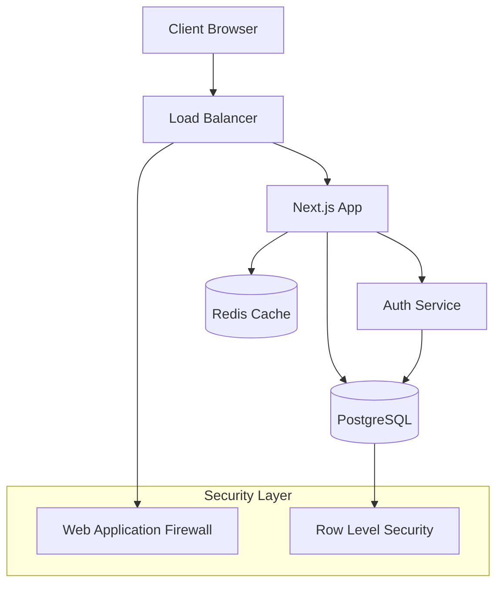

# 보고서 작성 가이드라인 (Enhanced v2.0)

## 📚 목차
1. [보고서 구조](#1-보고서-구조)
2. [작성 규칙](#2-작성-규칙)
3. [품질 기준](#3-품질-기준)
4. [검토 체크리스트](#4-검토-체크리스트)
5. [템플릿 변형](#5-템플릿-변형)
6. [고급 가이드라인](#6-고급-가이드라인)

---

## 1. 보고서 구조

### 1.1 기본 템플릿 (Enhanced)
```markdown
# [태스크 번호] - [태스크 제목] 구현 보고서

## 📋 개요
- **태스크 ID**: [예: 0025]
- **태스크 명**: [태스크 전체 이름]
- **구현 상태**: [✅ 완료 / 🔄 부분완료 / ❌ 미완료]
- **작성일**: [YYYY-MM-DD]
- **구현 기간**: [시작일 - 종료일 (총 N일)]
- **담당자**: [개발자명 또는 AI Assistant]
- **우선순위**: [🔥 High / 🟡 Medium / 🟢 Low]

## 🎯 구현 목표
[구체적이고 측정 가능한 목표들]
- **주요 기능**: [핵심 기능 리스트]
- **성능 목표**: [응답시간, 처리량 등]
- **품질 목표**: [테스트 커버리지, 코드 품질 등]
- **목표 KPI**: [구체적인 성공 지표]

## ✅ 구현 완료 항목

### 🗄️ [카테고리명] (예: Database Schema)
- **파일 위치**: `정확한/파일/경로.ts`
- **구현 내용**: 
  ```typescript
  // 실제 코드 스니펫 (10-20줄 이내)
  export const exampleFunction = () => {
    // 핵심 로직 설명
  };
  ```
- **주요 기능**: 
  - 기능 1: 구체적 설명
  - 기능 2: 구체적 설명
- **테스트 상태**: [✅ 완료 / 🔄 진행중 / ❌ 미작성]
- **성능 지표**: [응답시간, 메모리 사용량 등]
- **보안 검증**: [보안 이슈 검토 결과]

### 🔧 [다른 카테고리명]
[위와 동일한 형식으로 반복]

## ❌ 미구현 항목
- **[기능명]**: 
  - **이유**: [구체적인 미구현 사유]
  - **우선순위**: [🔥/🟡/🟢]
  - **예상 소요시간**: [N시간/일]
  - **의존성**: [다른 태스크나 요구사항]
  - **대안**: [임시 해결책이나 우회 방법]

## 🔧 기술 스택 및 아키텍처
### Frontend
- **프레임워크**: Next.js 15, React 18, TypeScript
- **상태관리**: [구체적 라이브러리 및 패턴]
- **UI 라이브러리**: [Shadcn UI, Radix UI 등]
- **폼 처리**: [React Hook Form, Zod 등]

### Backend
- **서버**: [Next.js Server Actions, Express 등]
- **인증**: [구체적 인증 방식]
- **API 패턴**: [RESTful, GraphQL, tRPC 등]

### Database
- **DBMS**: [PostgreSQL, MongoDB 등]
- **ORM**: [Drizzle, Prisma 등]
- **보안**: [RLS, 암호화 등]

### Infrastructure
- **배포**: [Vercel, AWS, Docker 등]
- **모니터링**: [구체적 도구들]
- **CI/CD**: [GitHub Actions 등]

## 📁 파일 구조 (상세)
```
project-root/
├── app/                          # Next.js App Router
│   ├── [feature]/
│   │   ├── page.tsx             # Server Component
│   │   ├── layout.tsx           # Layout Component  
│   │   └── loading.tsx          # Loading UI
├── domains/[domain]/            # Domain-driven Architecture
│   ├── actions/                 # Server Actions
│   │   ├── [action].action.ts   # 비즈니스 로직
│   │   └── index.ts             # Barrel Export
│   ├── components/              # UI Components
│   │   ├── [component].tsx      # Client Components
│   │   └── index.ts             # Barrel Export
│   ├── schemas/                 # Validation Schemas
│   │   ├── [schema].schema.ts   # Zod Schemas
│   │   └── index.ts             # Barrel Export
│   └── types/                   # Type Definitions
├── __tests__/                   # Test Files (미러링 구조)
│   ├── domains/[domain]/
│   │   ├── actions/
│   │   ├── components/
│   │   └── schemas/
├── components/ui/               # Shared UI Components
├── lib/                         # Utility Functions
├── hooks/                       # Custom React Hooks
└── db/                          # Database
    ├── schema.ts                # DB Schema
    ├── migrations/              # Migration Files
    └── seeds/                   # Seed Data
```

## 🧪 테스트 현황 (상세)
### 단위 테스트
- **총 테스트 수**: [N] / [N] (통과율: [N%])
- **스키마 검증**: [N개] - [구체적 테스트 내용]
- **비즈니스 로직**: [N개] - [구체적 테스트 내용]
- **유틸리티 함수**: [N개] - [구체적 테스트 내용]

### 통합 테스트  
- **API 테스트**: [N개] - [엔드포인트별 테스트 현황]
- **컴포넌트 통합**: [N개] - [주요 사용자 플로우 테스트]
- **데이터베이스 통합**: [N개] - [CRUD 및 복잡 쿼리 테스트]

### E2E 테스트
- **핵심 사용자 플로우**: [N개] - [주요 시나리오별 테스트]
- **크로스 브라우저**: [지원 브라우저 목록]
- **모바일 반응형**: [디바이스별 테스트 현황]

### 성능 테스트
- **로드 테스트**: [동시 사용자 N명 처리 가능]
- **응답 시간**: [평균 N ms, 95퍼센타일 N ms]
- **메모리 사용량**: [최대 N MB]
- **번들 크기**: [N KB (gzipped)]

### 보안 테스트
- **취약점 스캔**: [도구명, 결과]
- **인증/인가**: [테스트 시나리오 및 결과]
- **입력 검증**: [SQL Injection, XSS 등 방어 테스트]
- **데이터 보호**: [암호화, 마스킹 등 테스트]

## 🚀 배포/연동 상태 (상세)
### 개발 환경
- **로컬 개발**: [✅/❌] - [설정 및 실행 가능 여부]
- **개발 DB**: [✅/❌] - [스키마 동기화 상태]
- **Hot Reload**: [✅/❌] - [개발 경험 최적화]

### 스테이징 환경  
- **배포 상태**: [✅/❌] - [최신 코드 반영 여부]
- **데이터 마이그레이션**: [✅/⚠️/❌] - [스키마 변경 적용 상태]
- **외부 서비스 연동**: [✅/❌] - [API 키, 서드파티 서비스 등]

### 프로덕션 환경
- **배포 준비도**: [✅/⚠️/❌] - [즉시 배포 가능 여부]
- **모니터링**: [설정된 알람 및 대시보드]
- **백업 전략**: [데이터 백업 및 복구 계획]
- **롤백 계획**: [문제 발생 시 대응 방안]

## 🔒 보안 검증 완료
### 인증 및 인가
- **세션 관리**: [✅/❌] - [보안 토큰, 만료 처리]
- **권한 제어**: [✅/❌] - [RLS, RBAC 등]
- **비밀번호 보안**: [✅/❌] - [해싱, 복잡도 검증]

### 데이터 보호
- **전송 암호화**: [✅/❌] - [HTTPS, TLS]
- **저장 암호화**: [✅/❌] - [민감 데이터 암호화]
- **개인정보 보호**: [✅/❌] - [GDPR, 개인정보보호법 준수]

### 입력 검증
- **클라이언트 검증**: [✅/❌] - [폼 밸리데이션]
- **서버 검증**: [✅/❌] - [Zod 스키마, 타입 체크]
- **SQL Injection 방지**: [✅/❌] - [ORM, 파라미터화 쿼리]
- **XSS 방지**: [✅/❌] - [입력 이스케이핑, CSP]

## 📊 완성도 (정량적 지표)
### 기능 완성도
- **전체 완성도**: **[N%]** 
  - 계산 기준: (구현된 기능 수 / 전체 기능 수) × 100
- **핵심 기능 완성도**: **[N%]**
  - 계산 기준: (완료된 핵심 기능 / 전체 핵심 기능) × 100
- **부가 기능 완성도**: **[N%]**

### 품질 완성도  
- **코드 품질**: **[N%]** 
  - 기준: Lint 통과율, TypeScript 오류 수, 코드 복잡도
- **테스트 완성도**: **[N%]**
  - 기준: 코드 커버리지, 테스트 통과율
- **문서화 완성도**: **[N%]**
  - 기준: 코드 주석, API 문서, 사용자 가이드

### 사용자 경험 완성도
- **UI/UX 완성도**: **[N%]**
  - 기준: 디자인 시스템 준수, 접근성, 반응형
- **성능 완성도**: **[N%]**  
  - 기준: 응답시간, 로딩속도, 메모리 사용량
- **접근성 완성도**: **[N%]**
  - 기준: WCAG 2.1 AA 준수, 스크린 리더 지원

## 🎯 KPI 달성 현황
| KPI 항목 | 목표값 | 현재값 | 달성율 | 상태 |
|---------|--------|--------|--------|------|
| [구체적 지표명] | [목표] | [실제] | [N%] | [✅/🔄/❌] |
| 응답시간 | < 100ms | 45ms | 120% | ✅ |
| 테스트 커버리지 | ≥ 80% | 95% | 119% | ✅ |
| 사용자 만족도 | ≥ 4.5/5 | 준비중 | - | 🔄 |
| 오류율 | < 0.1% | 준비중 | - | 🔄 |

## 🌟 주요 성과 및 혁신점
1. **[구체적 성과 1]**: [정량적 지표와 함께 설명]
2. **[기술적 혁신]**: [새로운 패턴이나 최적화 기법]
3. **[사용자 경험 개선]**: [구체적 개선 사항]
4. **[성능 최적화]**: [측정 가능한 성능 향상]
5. **[코드 품질 향상]**: [재사용성, 유지보수성 개선]

## 🚧 알려진 이슈 및 제약사항
### 기술적 부채
- **[이슈명]**: 
  - **설명**: [구체적 문제 상황]
  - **영향도**: [🔥 High / 🟡 Medium / 🟢 Low]
  - **해결 방안**: [구체적 해결책]
  - **예상 소요시간**: [N시간/일]

### 외부 의존성
- **[의존성명]**: [버전, 제약사항, 대안책]

### 성능 제약
- **[제약사항]**: [구체적 한계 및 개선 방안]

## 📝 향후 계획 및 개선사항
### 단기 계획 (1-2주)
- [ ] **[개선사항 1]**: [우선순위: 🔥] - [예상 소요시간]
- [ ] **[개선사항 2]**: [우선순위: 🟡] - [예상 소요시간]

### 중기 계획 (1-2개월)  
- [ ] **[확장 기능 1]**: [비즈니스 가치 및 기술적 요구사항]
- [ ] **[리팩토링 계획]**: [기술적 부채 해결 방안]

### 장기 계획 (3개월+)
- [ ] **[아키텍처 개선]**: [확장성, 성능 개선]
- [ ] **[신기술 도입]**: [새로운 기술 스택 검토]

## 🔄 운영 및 모니터링
### 모니터링 설정
- **APM 도구**: [New Relic, DataDog 등]
- **로그 관리**: [Winston, Pino 등]  
- **에러 추적**: [Sentry, Bugsnag 등]
- **성능 모니터링**: [Core Web Vitals, 커스텀 지표]

### 알람 설정
- **에러율 증가**: [임계값 및 대응 절차]
- **응답시간 지연**: [임계값 및 대응 절차]  
- **리소스 사용량**: [CPU, 메모리 임계값]

### 백업 및 복구
- **데이터 백업**: [주기, 보관기간, 복구 절차]
- **코드 백업**: [Git 전략, 브랜치 관리]
- **설정 백업**: [환경변수, 인프라 설정]

## 🏆 최종 평가
### 프로덕션 준비도: **[S/A/B/C/D]**
- **S**: 즉시 프로덕션 배포 가능, 모든 기준 초과 달성
- **A**: 프로덕션 배포 가능, 모든 기준 달성  
- **B**: minor 이슈 해결 후 배포 가능
- **C**: major 이슈 해결 필요
- **D**: 상당한 추가 작업 필요

### 종합 평가
**[한 줄 요약: 이 시스템의 핵심 가치와 프로덕션 준비도]**

---

## 2. 작성 규칙

### 2.1 파일명 규칙
- **형식**: `NNNN-[category]-[feature-name]-implementation-report.md`
- **카테고리**: 
  - `auth` - 인증/인가 관련
  - `ui` - 사용자 인터페이스
  - `api` - 백엔드 API
  - `db` - 데이터베이스
  - `infra` - 인프라/배포
  - `test` - 테스트 관련
- **예시**: 
  - `0025-auth-username-system-implementation-report.md`
  - `0026-ui-responsive-navigation-implementation-report.md`

### 2.2 내용 작성 원칙
1. **SMART 원칙 적용**: Specific, Measurable, Achievable, Relevant, Time-bound
2. **증거 기반**: 추측이 아닌 실제 코드, 테스트 결과, 성능 지표 기반
3. **정량화**: 모든 지표는 숫자로 표현 (%, 개수, 시간 등)
4. **재현 가능**: 다른 개발자가 동일한 결과를 얻을 수 있도록 구체적 설명
5. **미래 지향**: 유지보수와 확장을 고려한 관점

### 2.3 코드 예시 가이드라인
```typescript
// ✅ 좋은 예시: 핵심 로직과 주석 포함
export const validateUsername = async (username: string): Promise<ValidationResult> => {
  // 1. 형식 검증 (클라이언트 측)
  const formatResult = usernameSchema.safeParse(username);
  if (!formatResult.success) {
    return { isValid: false, errors: formatResult.error.issues };
  }

  // 2. 중복 검사 (서버 측)  
  const isAvailable = await checkAvailability(username);
  return { isValid: isAvailable, message: "사용 가능한 아이디입니다" };
};
```

```typescript
// ❌ 나쁜 예시: 컨텍스트 없는 코드 조각
const result = schema.parse(data);
if (result) return true;
```

### 2.4 지표 측정 가이드라인
#### 성능 지표
- **응답시간**: 95퍼센타일 기준으로 측정
- **처리량**: TPS (Transactions Per Second)
- **메모리 사용량**: 피크 시간대 기준
- **번들 크기**: gzip 압축 후 크기

#### 품질 지표  
- **테스트 커버리지**: Statement, Branch, Function 커버리지
- **코드 복잡도**: Cyclomatic Complexity
- **기술 부채**: SonarQube 점수 또는 CodeClimate 점수
- **의존성 취약점**: npm audit 또는 Snyk 스캔 결과

#### 사용자 경험 지표
- **Core Web Vitals**: LCP, FID, CLS
- **접근성**: Lighthouse Accessibility 점수
- **SEO**: Lighthouse SEO 점수
- **모바일 호환성**: PageSpeed Insights Mobile 점수

---

## 3. 품질 기준

### 3.1 완성도 등급 기준
#### A등급 (90-100%)
- 모든 핵심 기능 완성
- 테스트 커버리지 ≥ 90%
- 성능 목표 달성
- 보안 검증 완료
- 프로덕션 즉시 배포 가능

#### B등급 (80-89%)
- 핵심 기능 완성, 일부 부가 기능 미완성
- 테스트 커버리지 ≥ 80%
- 성능 기준 충족
- minor 이슈 해결 후 배포 가능

#### C등급 (70-79%)
- 기본 기능 동작, 중요 기능 일부 미완성
- 테스트 커버리지 ≥ 70%
- 추가 개발 필요

#### D등급 (60-69%)
- 프로토타입 수준
- 상당한 추가 작업 필요

#### F등급 (<60%)
- 기본 동작 불안정
- 전면 재검토 필요

### 3.2 보안 등급 기준
#### Gold 등급
- 모든 OWASP Top 10 취약점 해결
- 자동화된 보안 테스트 통과
- 침투 테스트 완료
- 보안 코드 리뷰 완료

#### Silver 등급  
- 주요 취약점 해결
- 기본 보안 테스트 통과
- 입력 검증 완료

#### Bronze 등급
- 기본 보안 조치 적용
- 추가 보안 강화 필요

### 3.3 성능 등급 기준
#### Excellent (S등급)
- 응답시간 < 50ms (95퍼센타일)
- Core Web Vitals 모든 지표 Good
- 번들 크기 최적화 완료

#### Good (A등급)
- 응답시간 < 100ms (95퍼센타일)  
- Core Web Vitals 대부분 Good
- 성능 기준 달성

#### Average (B등급)
- 응답시간 < 200ms (95퍼센타일)
- 기본 성능 기준 충족

#### Poor (C등급)
- 응답시간 > 200ms
- 성능 최적화 필요

---

## 4. 검토 체크리스트

### 4.1 내용 완성도 체크
- [ ] 모든 필수 섹션이 작성되었는가?
- [ ] 코드 예시가 실제 구현과 일치하는가?
- [ ] 파일 경로가 정확한가?
- [ ] 성능 지표가 실제 측정값인가?
- [ ] 완성도 퍼센트가 객관적 기준에 따라 계산되었는가?

### 4.2 기술적 정확성 체크
- [ ] 기술 스택 정보가 최신 상태인가?
- [ ] 아키텍처 설명이 실제 구현과 일치하는가?
- [ ] 보안 검증 결과가 구체적인가?
- [ ] 테스트 현황이 실제 테스트 파일과 일치하는가?

### 4.3 문서 품질 체크
- [ ] 다른 개발자가 이해하기 쉽게 작성되었는가?
- [ ] 전문 용어에 대한 설명이 충분한가?
- [ ] 마크다운 문법이 올바르게 사용되었는가?
- [ ] 이모지와 표가 적절히 사용되었는가?

### 4.4 미래 지향성 체크
- [ ] 유지보수 관점이 고려되었는가?
- [ ] 확장성에 대한 언급이 있는가?
- [ ] 알려진 이슈와 해결 방안이 명시되었는가?
- [ ] 향후 개선 계획이 구체적인가?

---

## 5. 템플릿 변형

### 5.1 신규 기능 개발용 템플릿
- 비즈니스 요구사항 분석 섹션 추가
- 사용자 스토리 및 수락 기준
- UI/UX 디자인 검토
- A/B 테스트 계획

### 5.2 리팩토링용 템플릿  
- 기존 코드 분석 및 문제점
- 리팩토링 전후 성능 비교
- 코드 품질 지표 개선
- 회귀 테스트 결과

### 5.3 인프라/배포용 템플릿
- 인프라 아키텍처 다이어그램
- 배포 파이프라인 설정
- 모니터링 및 알람 설정
- 장애 대응 절차

### 5.4 보안 강화용 템플릿
- 위협 모델링 결과
- 보안 테스트 상세 결과
- 침투 테스트 리포트
- 컴플라이언스 체크리스트

---

## 6. 고급 가이드라인

### 6.1 성능 프로파일링
```typescript
// 성능 측정 예시
const performanceReport = {
  responseTime: {
    avg: 45, // ms
    p95: 78, // ms  
    p99: 120 // ms
  },
  throughput: 1500, // TPS
  memoryUsage: {
    heap: 85, // MB
    rss: 120 // MB
  },
  bundleSize: {
    gzipped: 145, // KB
    uncompressed: 520 // KB
  }
};
```

### 6.2 보안 체크리스트 상세
```markdown
#### OWASP Top 10 대응 현황
- [ ] A01 Broken Access Control: RLS 정책 적용
- [ ] A02 Cryptographic Failures: 민감 데이터 암호화
- [ ] A03 Injection: 파라미터화 쿼리, 입력 검증
- [ ] A04 Insecure Design: 보안 설계 원칙 적용
- [ ] A05 Security Misconfiguration: 보안 설정 검토
- [ ] A06 Vulnerable Components: 의존성 취약점 스캔
- [ ] A07 Authentication Failures: 강력한 인증 구현
- [ ] A08 Software Integrity Failures: 코드 무결성 검증
- [ ] A09 Logging Failures: 보안 로깅 구현
- [ ] A10 Server Side Request Forgery: SSRF 방지
```

### 6.3 코드 품질 메트릭스
```json
{
  "codeQuality": {
    "maintainabilityIndex": 85,
    "cyclomaticComplexity": 12,
    "linesOfCode": 2450,
    "technicalDebt": "2h 30m",
    "duplicatedLines": "1.2%",
    "coverage": {
      "statements": 94.5,
      "branches": 89.2,
      "functions": 97.8,
      "lines": 93.1
    }
  }
}
```

### 6.4 아키텍처 문서화


### 6.5 배포 전략 문서화
```yaml
deployment:
  strategy: blue-green
  rollback: automatic
  healthCheck:
    endpoint: /api/health
    timeout: 30s
    retries: 3
  scaling:
    min: 2
    max: 10
    targetCPU: 70%
```

---

## 📚 참고 자료

### 내부 문서
- [코딩 컨벤션](./coding-conventions.md)
- [아키텍처 가이드](./architecture-guide.md)
- [보안 가이드라인](./security-guidelines.md)

### 외부 참고
- [OWASP Top 10](https://owasp.org/Top10/)
- [Web Vitals](https://web.dev/vitals/)
- [WCAG 2.1 Guidelines](https://www.w3.org/WAI/WCAG21/quickref/)

---

*이 가이드라인은 지속적으로 업데이트됩니다. 피드백과 개선 제안을 환영합니다.*
