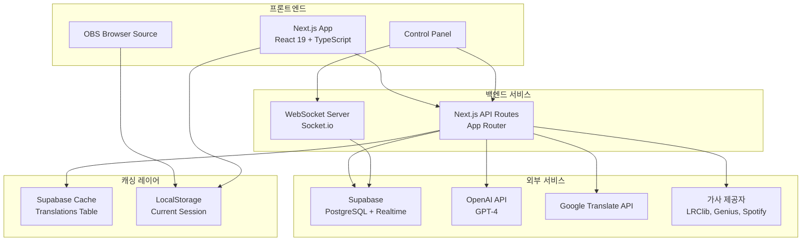

# 🏗️ 백엔드 아키텍처 문서

## 📋 목차
- [시스템 아키텍처 개요](#시스템-아키텍처-개요)
- [Supabase 데이터베이스 구조](#supabase-데이터베이스-구조)
- [API 엔드포인트](#api-엔드포인트)
- [WebSocket 서버 구조](#websocket-서버-구조)
- [배포 가이드](#배포-가이드)
- [보안 및 인증](#보안-및-인증)

## 🎯 시스템 아키텍처 개요



## 💾 Supabase 데이터베이스 구조

### 1. 테이블 구조

#### `lyrics` 테이블
```sql
CREATE TABLE lyrics (
  id UUID PRIMARY KEY DEFAULT gen_random_uuid(),
  title TEXT NOT NULL,
  artist TEXT NOT NULL,
  album TEXT,
  lrc_content TEXT NOT NULL,      -- 원본 LRC 파일 내용
  lines JSONB,                     -- 파싱된 가사 라인 배열
  metadata JSONB,                  -- 추가 메타데이터
  created_at TIMESTAMPTZ DEFAULT NOW(),
  updated_at TIMESTAMPTZ DEFAULT NOW()
);

-- 인덱스
CREATE INDEX idx_lyrics_title_artist ON lyrics(title, artist);
CREATE INDEX idx_lyrics_created_at ON lyrics(created_at DESC);
```

#### `translations` 테이블
```sql
CREATE TABLE translations (
  id UUID PRIMARY KEY DEFAULT gen_random_uuid(),
  lyrics_id UUID REFERENCES lyrics(id) ON DELETE CASCADE,
  line_index INTEGER NOT NULL,
  original_text TEXT NOT NULL,
  translated_text TEXT NOT NULL,
  target_language TEXT NOT NULL,
  timestamp FLOAT,
  duration FLOAT,
  metadata JSONB,                  -- 단어별 타이밍, 발음 등
  created_at TIMESTAMPTZ DEFAULT NOW(),
  UNIQUE(lyrics_id, line_index, target_language)
);

-- 인덱스
CREATE INDEX idx_translations_lyrics_id ON translations(lyrics_id);
CREATE INDEX idx_translations_unique ON translations(lyrics_id, line_index, target_language);
```

### 2. JSONB 데이터 구조

#### `lyrics.lines` 구조
```json
[
  {
    "id": "line_1",
    "text": "Hello world",
    "startTime": 12000,
    "endTime": 15000,
    "words": [
      {
        "text": "Hello",
        "startTime": 12000,
        "endTime": 12500
      },
      {
        "text": "world",
        "startTime": 12500,
        "endTime": 15000
      }
    ]
  }
]
```

#### `translations.metadata` 구조
```json
{
  "words": [
    {
      "original": "Hello",
      "translated": "안녕",
      "pronunciation": "annyeong"
    }
  ],
  "context": {
    "previousLine": "...",
    "nextLine": "..."
  },
  "confidence": 0.95,
  "translationMethod": "gpt-4"
}
```

### 3. Row Level Security (RLS) 정책

```sql
-- 읽기 권한: 모든 사용자
CREATE POLICY "Enable read access for all users" ON lyrics
  FOR SELECT USING (true);

CREATE POLICY "Enable read access for all users" ON translations
  FOR SELECT USING (true);

-- 쓰기 권한: 인증된 사용자
CREATE POLICY "Enable insert for authenticated users only" ON lyrics
  FOR INSERT WITH CHECK (auth.role() = 'authenticated');

CREATE POLICY "Enable insert for authenticated users only" ON translations
  FOR INSERT WITH CHECK (auth.role() = 'authenticated');
```

## 🔌 API 엔드포인트

### 1. 가사 검색 API
**`POST /api/lyrics/search`**

```typescript
// Request
{
  query: string;          // 검색어 또는 URL
  providers?: string[];   // ['lrclib', 'genius', 'spotify']
}

// Response
{
  results: [{
    id: string;
    title: string;
    artist: string;
    album?: string;
    provider: string;
    confidence: number;
    hasSyncedLyrics: boolean;
  }]
}
```

**구현 로직:**
1. 여러 프로바이더에 병렬 검색 요청
2. 결과 통합 및 중복 제거
3. 신뢰도 점수 계산
4. Supabase에 캐싱

### 2. 번역 API
**`POST /api/translate/ai`**

```typescript
// Request
{
  text: string;
  targetLanguage: string;
  context?: {
    previousLine?: string;
    nextLine?: string;
  };
  lyricsId?: string;
  lineIndex?: number;
}

// Response
{
  translatedText: string;
  confidence: number;
  cached: boolean;
}
```

**구현 로직:**
1. 캐시 확인 (Supabase translations 테이블)
2. 캐시 미스 시 GPT-4 API 호출
3. 컨텍스트 기반 번역 최적화
4. 결과 캐싱

### 3. 가사 저장 API
**`POST /api/lyrics/save`**

```typescript
// Request
{
  title: string;
  artist: string;
  lrcContent: string;
  lines: LyricLine[];
}

// Response
{
  id: string;
  success: boolean;
}
```

## 🔄 WebSocket 서버 구조

### 1. 서버 구성
```javascript
// server/websocket-server.js
const io = new Server(httpServer, {
  cors: {
    origin: process.env.NEXT_PUBLIC_APP_URL,
    methods: ['GET', 'POST']
  },
  transports: ['websocket', 'polling']
});
```

### 2. 이벤트 핸들러

#### Room Management
```javascript
// 방 생성
socket.on('create_room', (data) => {
  const roomId = generateRoomId();
  rooms.set(roomId, {
    hostId: data.hostId,
    participants: new Map(),
    currentLyrics: null,
    playbackState: {...}
  });
});

// 방 참여
socket.on('join_room', (data) => {
  room.participants.set(socket.id, participant);
  socket.join(data.roomId);
});
```

#### Synchronization
```javascript
// 재생 동기화
socket.on('sync_playback', (data) => {
  io.to(data.roomId).emit('playback_updated', {
    playbackState: data.playbackState
  });
});

// 가사 변경
socket.on('change_lyrics', (data) => {
  room.currentLyrics = data.lyrics;
  io.to(data.roomId).emit('lyrics_changed', data);
});
```

### 3. 상태 관리
```typescript
interface RoomState {
  roomId: string;
  hostId: string;
  participants: Map<string, Participant>;
  currentLyrics: ParsedLRC | null;
  playbackState: PlaybackState;
  settings: RoomSettings;
}

interface Participant {
  id: string;
  nickname: string;
  role: 'host' | 'viewer';
  joinedAt: Date;
  isActive: boolean;
  preferredLanguage?: string;
}
```

## 🚀 배포 가이드

### 1. Git 푸시
```bash
# 변경사항 확인
git status

# 모든 변경사항 스테이징
git add -A

# 커밋
git commit -m "feat: production deployment configuration"

# GitHub에 푸시
git push origin main
```

### 2. Vercel 배포 설정

#### A. Vercel CLI 설치
```bash
npm i -g vercel
```

#### B. 프로젝트 연결
```bash
vercel

# 다음 질문에 답변:
? Set up and deploy "~/lyrics-translator"? [Y/n] Y
? Which scope do you want to deploy to? Your Account
? Link to existing project? [y/N] N
? What's your project's name? lyrics-translator
? In which directory is your code located? ./
```

#### C. 환경 변수 설정
```bash
# Vercel 대시보드에서 설정하거나 CLI 사용
vercel env add NEXT_PUBLIC_SUPABASE_URL
vercel env add NEXT_PUBLIC_SUPABASE_ANON_KEY
vercel env add SUPABASE_SERVICE_ROLE_KEY
vercel env add OPENAI_API_KEY
vercel env add NEXT_PUBLIC_GOOGLE_API_KEY
```

#### D. 프로덕션 배포
```bash
vercel --prod
```

### 3. WebSocket 서버 배포 (별도)

WebSocket 서버는 Vercel에서 지원하지 않으므로 별도 배포 필요:

#### 옵션 1: Railway.app
```bash
# Railway CLI 설치
npm install -g @railway/cli

# 배포
railway login
railway init
railway add
railway up
```

#### 옵션 2: Render.com
1. Render.com에서 새 Web Service 생성
2. GitHub 저장소 연결
3. Build Command: `npm install`
4. Start Command: `node server/websocket-server.js`
5. 환경 변수 설정

#### 옵션 3: Fly.io
```bash
# Fly CLI 설치
curl -L https://fly.io/install.sh | sh

# 배포
fly launch
fly deploy
```

### 4. Supabase 프로덕션 설정

#### A. 프로젝트 생성
1. [Supabase](https://app.supabase.com) 대시보드 접속
2. New Project 생성
3. Region: Seoul (ap-northeast-2) 선택

#### B. 데이터베이스 마이그레이션
```sql
-- SQL Editor에서 실행
-- 1. 테이블 생성
CREATE TABLE lyrics (...);
CREATE TABLE translations (...);

-- 2. 인덱스 생성
CREATE INDEX ...;

-- 3. RLS 정책 설정
ALTER TABLE lyrics ENABLE ROW LEVEL SECURITY;
ALTER TABLE translations ENABLE ROW LEVEL SECURITY;

-- 4. 정책 생성
CREATE POLICY ...;
```

#### C. API 키 확인
- Settings → API → Project API keys
- `anon` key: 클라이언트용
- `service_role` key: 서버용

## 🔐 보안 및 인증

### 1. API 키 보안
```typescript
// 클라이언트 사이드 (공개 가능)
const supabase = createClient(
  process.env.NEXT_PUBLIC_SUPABASE_URL!,
  process.env.NEXT_PUBLIC_SUPABASE_ANON_KEY!
);

// 서버 사이드 (비공개)
const supabaseAdmin = createClient(
  process.env.NEXT_PUBLIC_SUPABASE_URL!,
  process.env.SUPABASE_SERVICE_ROLE_KEY!,
  { auth: { persistSession: false } }
);
```

### 2. Rate Limiting
```typescript
// API Route에서 구현
import rateLimit from 'express-rate-limit';

const limiter = rateLimit({
  windowMs: 15 * 60 * 1000, // 15분
  max: 100, // 최대 100개 요청
  message: 'Too many requests'
});
```

### 3. CORS 설정
```typescript
// next.config.js
module.exports = {
  async headers() {
    return [
      {
        source: '/api/:path*',
        headers: [
          { key: 'Access-Control-Allow-Origin', value: '*' },
          { key: 'Access-Control-Allow-Methods', value: 'GET,POST' }
        ]
      }
    ];
  }
};
```

## 📊 모니터링 및 로깅

### 1. Vercel Analytics
```bash
npm install @vercel/analytics
```

```typescript
// app/layout.tsx
import { Analytics } from '@vercel/analytics/react';

export default function RootLayout() {
  return (
    <html>
      <body>
        {children}
        <Analytics />
      </body>
    </html>
  );
}
```

### 2. Supabase 모니터링
- Dashboard → Reports에서 실시간 모니터링
- Database 쿼리 성능 분석
- Storage 사용량 확인

### 3. 에러 트래킹 (Sentry)
```bash
npm install @sentry/nextjs
npx @sentry/wizard -i nextjs
```

## 🔄 CI/CD 파이프라인

### GitHub Actions 설정
`.github/workflows/deploy.yml`:

```yaml
name: Deploy to Vercel

on:
  push:
    branches: [main]
  pull_request:
    branches: [main]

jobs:
  deploy:
    runs-on: ubuntu-latest
    
    steps:
      - uses: actions/checkout@v3
      
      - name: Setup Node.js
        uses: actions/setup-node@v3
        with:
          node-version: '20'
          
      - name: Install dependencies
        run: npm ci
        
      - name: Run tests
        run: npm test
        
      - name: Build
        run: npm run build
        
      - name: Deploy to Vercel
        uses: amondnet/vercel-action@v25
        with:
          vercel-token: ${{ secrets.VERCEL_TOKEN }}
          vercel-org-id: ${{ secrets.VERCEL_ORG_ID }}
          vercel-project-id: ${{ secrets.VERCEL_PROJECT_ID }}
```

## 🏗️ 스케일링 전략

### 1. 데이터베이스 최적화
- 인덱스 최적화
- 쿼리 캐싱
- Connection Pooling

### 2. CDN 활용
- Vercel Edge Network
- 정적 자산 캐싱
- 이미지 최적화

### 3. 서버리스 함수 최적화
- Cold Start 최소화
- 함수 크기 최적화
- 병렬 처리

## 📝 환경별 설정

### Development
```env
NEXT_PUBLIC_APP_URL=http://localhost:3000
NEXT_PUBLIC_SUPABASE_URL=https://xxx.supabase.co
WEBSOCKET_PORT=3001
```

### Staging
```env
NEXT_PUBLIC_APP_URL=https://staging.lyrics-translator.vercel.app
NEXT_PUBLIC_SUPABASE_URL=https://xxx-staging.supabase.co
WEBSOCKET_URL=wss://staging-ws.railway.app
```

### Production
```env
NEXT_PUBLIC_APP_URL=https://lyrics-translator.vercel.app
NEXT_PUBLIC_SUPABASE_URL=https://xxx-prod.supabase.co
WEBSOCKET_URL=wss://ws.lyrics-translator.com
```

---

🎤 **Lyrics Translator Backend** - 확장 가능하고 안정적인 백엔드 아키텍처