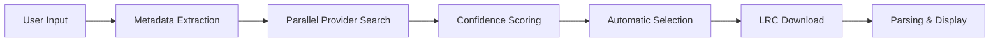

# Lyrics Translator Progress Report

_Last Updated: 2025-01-28_

## Executive Summary

The Lyrics Translator project is a karaoke-style lyrics display system with real-time translation capabilities, designed for singing broadcasts. The system automatically fetches lyrics (LRC files) from multiple sources, displays them with word-by-word highlighting synchronized to the music, and provides real-time translations for international audiences.

## Architecture Overview

### Domain-Driven Design Structure

```
src/domains/
├── lyrics/          # Core lyrics data structures and parsing
├── lrc-fetcher/     # Automatic LRC file retrieval pipeline  
├── metadata/        # Song information extraction
├── karaoke/         # (Pending) Karaoke display and animation
├── translation/     # (Pending) Real-time translation service
├── sync/           # (Pending) Audio synchronization
├── overlay/        # (Pending) OBS overlay rendering
├── settings/       # (Pending) User preferences
└── ui/             # (Pending) Shared UI components
```

## Completed Components

### 1. LRC Parser System
- **Location**: `src/domains/lyrics/`
- **Features**:
  - Standard LRC format parsing `[mm:ss.xx]lyrics`
  - Extended format with word timing `<mm:ss.xx>word`
  - Metadata extraction (title, artist, album)
  - Error handling and validation
  - Utility functions for timing conversion

### 2. Automatic LRC Fetching Pipeline
- **Location**: `src/domains/lrc-fetcher/`
- **Implemented Providers**:
  - LRClib.net (free, open-source)
  - Base provider infrastructure with rate limiting
- **Features**:
  - Confidence-based result scoring
  - String similarity matching
  - Extensible provider pattern

### 3. Metadata Extraction System
- **Location**: `src/domains/metadata/`
- **Extractors**:
  - YouTube URL parser (using noembed API)
  - Spotify URL parser (OAuth support)
  - Intelligent text parser for "Artist - Title" queries
- **Features**:
  - Automatic source detection
  - Metadata enhancement capabilities
  - Unified metadata interface

## Automatic LRC Pipeline Design

### Search Flow


### Confidence Scoring Algorithm
- Title similarity: 60% weight
- Artist similarity: 40% weight
- Duration matching: ±5 seconds bonus
- Word-level timing: 20% bonus
- Provider base confidence multiplier

### Fallback Strategy
1. Primary: High-confidence LRC with timing
2. Secondary: Plain lyrics → AI timing generation
3. Tertiary: Manual file upload

## Pending Implementation

### High Priority
1. **Spotify Lyrics Provider**: Unofficial API integration
2. **Genius Provider**: Lyrics-only fallback
3. **YouTube Subtitle Provider**: Music video captions
4. **LRC Fetcher Manager**: Orchestration service
5. **Karaoke Renderer**: Word highlighting engine

### Medium Priority
1. **Translation Service**: Google Translate integration
2. **Sync Manager**: Timing adjustment system
3. **OBS Overlay**: Transparent browser source
4. **Control Panel UI**: Song search interface

### Low Priority
1. **AI Timing Generator**: Whisper API integration
2. **Cache System**: 24-hour result caching
3. **Plugin Architecture**: Custom provider support

## Technical Decisions

### Why Automatic LRC Fetching?
- Eliminates manual file uploads
- Provides instant access to lyrics
- Ensures consistent timing quality
- Enables quick song switching during broadcasts

### Provider Selection
- **LRClib.net**: Free, reliable, community-driven
- **Spotify**: High accuracy, word-level timing
- **Genius**: Comprehensive database, no timing
- **YouTube**: Video-synced subtitles

### Technology Stack
- **Next.js 15**: Latest features, App Router
- **TypeScript**: Type safety, better DX
- **Framer Motion**: Smooth animations
- **Google Translate API**: Proven translation quality
- **OBS Browser Source**: Native integration

## Integration with Tools

### Serena MCP Usage
- Project structure analysis ✓
- Symbol discovery and navigation
- Code refactoring assistance
- Memory management for project context

### Gemini CLI Integration
- Code review and optimization
- Architecture validation
- Performance analysis
- Best practices enforcement

## Next Steps

1. **Complete Provider Implementations**
   - Spotify lyrics endpoint
   - Genius API integration
   - YouTube subtitle extraction

2. **Build Core UI Components**
   - Search interface
   - Result selection
   - Karaoke display
   - Translation overlay

3. **Implement Synchronization**
   - Audio waveform analysis
   - Manual offset controls
   - Auto-sync algorithm

4. **Testing & Optimization**
   - Unit tests for providers
   - Integration tests
   - Performance profiling
   - OBS compatibility testing

## Risks & Mitigations

| Risk | Impact | Mitigation |
|------|--------|------------|
| API Rate Limits | Service interruption | Implement caching, rotating providers |
| Copyright Issues | Legal concerns | Clear attribution, DMCA compliance |
| Timing Accuracy | Poor user experience | Multiple sources, manual adjustment |
| OBS Performance | Stream quality | Optimize rendering, reduce effects |

## Conclusion

The Lyrics Translator project has established a solid architectural foundation with completed core parsing and metadata extraction systems. The automatic LRC fetching pipeline design eliminates the main pain point of manual uploads. With Serena MCP for code analysis and Gemini CLI for optimization, the project is well-positioned for rapid development of remaining components.